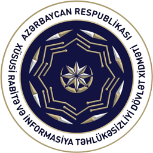

   

---

**Xüsusi Rabitə və İnformasiya Təhlükəsizliyi Dövlət Xidməti (XRİTDX)**, **Qarabug** bug bounty platformasına göstərdiyi ciddi [dəstək](https://marja.az/105337/azerbaycanda-bosluqlarinin-askarlanmasi-platformasi-ise-dusdu-qarabug) sayəsində ölkədə informasiya təhlükəsizliyi sahəsində və son dövrlərdə həyata keçirdiyi mühüm işlər nəticəsində əhəmiyyətli irəliləyişlər əldə olunmuşdur. Bu dəstək, yerli mütəxəssislər, qurumlar və təşkilatlar arasında əməkdaşlıq və güvən hissi yaratmışdır. Yerli mütəxəssislər, qanunvericiliyə uyğun olaraq həyata keçirdikləri tədqiqatlar və tapıntıların **XRİTDX** tərəfindən düzgün qiymətləndiriləcəyini və mükafatlandırılacağını bilirlər. Bu, həmçinin yerli təşkilatlarda əminlik yaradır ki, onların sistemləri 250-dən çox mütəxəssis tərəfindən daimi olaraq yoxlanılır və bu proses **XRİTDX** tərəfindən nəzarət dəstək altında aparılır. 

---

   

---

Qarabug platforması ilk yaradıldığı dövrdə, XRİTDX-nin mentorluq dəstəyi ilə, Qarabug-dakı proseslər, alqoritmlər, ölkə qanunvericiliyi və informasiya təhlükəsizliyi sahəsindəki mövcud vəziyyət nəzərə alınaraq təkmilləşdirildi. Bu, platformanın inkişafı üçün çox əhəmiyyətli bir addım oldu. Qarabug platforması olaraq bu dəstəksiz, bu sahədə araşdırmalar aparmaq və ya konsultasiya şirkətindən xidmət almaq kimi iki seçimlə qarşılaşmışdı.  

Startap olaraq Qarabug platforması, həm ümumi startap çətinlikləri, həm də yerli texnologiya sahəsinin  radikal dəyişikliklərə hazırlıqsızlığın səbəb olduğu bir çox çətinliklərlə üzləşmişdir. Hal-hazırda dünyada belə platformalar mövcuddur və həmin platformalarda iştirak edən azərbaycanlı mütəxəssislər də vardır. Lakin, bu platformaların Azərbaycanda fəaliyyət göstərməməsinin bir çox hüquqi səbəbləri vardır. Azərbaycan qanunvericiliyinə görə, müdaxilə testləri yalnız Azərbaycan vətəndaşları tərəfindən həyata keçirilə bilər, (bu isə təhlükəsizlik baxımından düzgün bir qərardır, xüsusilə dünyada baş verən hadisələri, APT və digər ciddi hücümları nəzərə aldıqda). Bəzi ölkələr, texnologiya sahəsində müdaxilə testləri keçirmək üçün müxtəlif vasitələrdən və fərqli qaydalardan istifadə edərək ölkə üzrə bu cür testləri həyata keçirirlər və mükafatlandırma proqramları təşkil edirlər. Məsələn, ABŞ-ın Ağ Evin Dövlət təşkilatları üçün bir [memorandumunda](https://www.whitehouse.gov/wp-content/uploads/2020/09/M-20-32.pdf) bu tip proqramlarda hansı amillərin nəzərə alınması barədə məlumat verilir. Digər maraqlı bir nümunə isə, İranda mütəxəssislərə müdaxilə testləri aparmaq məqsədilə [lisensiya](https://www.theregister.com/2020/12/08/iran_bug_bounty_program/) verilməsidir.

   

<h1>Azerbaycanda ciddi ilk addım GOV.AZ ölkə səviyyəsində boşluqların mükafatlandırma proqramı!</h1>

XRİTDX Qarabug vasitəsilə ölkə üzrə (http://*.gov.az) domenlərində boşluqların aşkarlanması üzrə mükafat proqramı başlanıb. Proqramın detalları, mükafatlar və digər şərtlər Qarabug platformasında hər kəsin istifadəsinə açıq olacaq. Hazırda platformada 250-dən çox mütəxəssisin müraciəti mövcuddur və bunlardan bir xeyli təsdiqlənmiş mütəxəssislər artıq platformada aktivdir. Digər mütəxəssislərin profilləri isə növbə ilə sistəmdə təsdiqlənilir. Ümumilikdə 20,000 AZN mükafat fondu və əlavə tanınma mükafatları təklif olunur.

XRİTDX və Qarabug arasındakı əməkdaşlıq digər texnologiya sahəsindəki qurumlar üçün nümunə olmalıdır. Onlar bu modeli öyrənməli və yerli startaplara güvənərək, heç bir tərəddüd etmədən və aktiv şəkildə müstəsna əməli dəstək göstərməlidirlər!